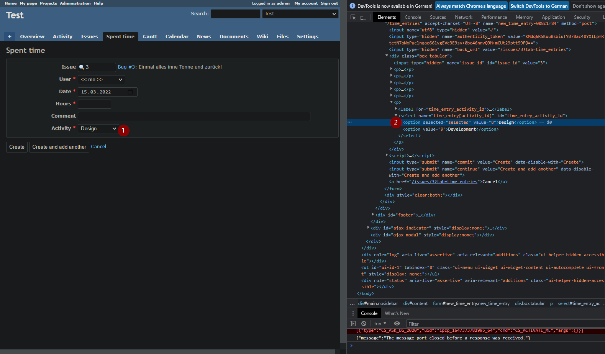

# Redmine integration

The redmine integration uses the clockify time entry data to log time to redmine.

## Configuration

```json
{
  "Clockify": {
    "Integrations": {
      "Redmine": {
        "Name": "Redmine@0", // Specify the integration to use
        "Args": {
          "Host": "http://localhost:8080", // Your redmine host
          "ApiKey": "01234567890123456789012345678901234567890", // Your redmine API key
          "VerifyServerCert": true, // Disable if you have self signed certs
          "Activities": { // Map Clockify tags to redmine activity IDs; you can use `0` to use the default activity as configured in your redmine instance
            "Default": 9,
            "design": 8 // The tag `design` will lead to the activity `8` in redmine
          },
          "Tags": [   // You can specify tag groups to filter the time entries which this integration should process
                      // Each group consists of an array of tags. All tags in a array must match. Groups are `OR` combined.
            [ "to-redmine" ],
            [ "redmine" ]
          ],
          "ProcessedTags": [ // Specify an array of tags to add after successful processing by this integration
            "in-redmine"
          ],
          "ErrorTags": [ // Specify an array of tags to add in case an error occured
            "failed-verify-manually"
          ]
        }
      }
    }
  }
}
```

## Activities

To make proper use of the extension, you'll have to obtain the activity ids from your redmine instance.

You can see them in the `Enumerations` section in the administrator console or get them in your browser developer tools.

