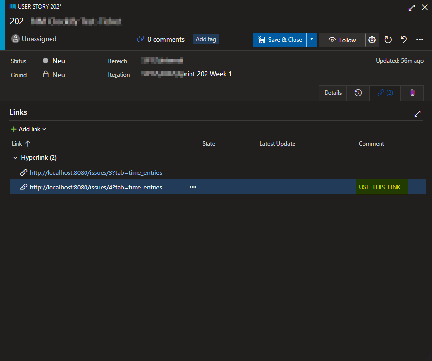

# Redmine over Azure DevOps integration

The Redmine over Azure DevOps integration extends the [Redmine integration](./redmine-0.md) by querying the redmine issue information from your Azure DevOps instance.

This integration processes time entries by fetching the referenced work-item and looking for [Hyperlink link types](https://docs.microsoft.com/en-us/azure/devops/boards/queries/link-type-reference?view=azure-devops#hyperlink-link-type) specifying at least one redmine issue. The integration will throw an exception if it cannot find a hyperlink or multiple hyperlinks to your configured redmine instance. Take a look at the `KeyComment` configuration key.

```json
{
  "Clockify": {
    "Integrations": {
      "MyDevOpsIntegration": {
        // Specify the integration to use
        "Name": "RedmineOverDevOps@0",
        "Args": {
          // Take a look at the redmine integration options
          "Redmine": {
            "Host": "http://localhost:8080",
            "ApiKey": "01234567890123456789012345678901234567890",
            "VerifyServerCert": true,
            "Activities": {
              "Default": 9,
              "design": 8
            }
          },
          // The url to your azure devops organization / collection
          "Host": "https://dev.azure.com/WORK-COLLECTION",

          // your PAT
          // Requires at least the `Work Items (Read & Write)` grants
          "PAT": "01234567890123456789012345678901234567890123456789",

          // Specify a key comment to specify the link to use. Will only be used if there's more than one matching hyperlink
          "KeyComment": "USE-THIS-LINK",
          // You can specify tag groups to filter the time entries which this integration should process
          // each group consists of an array of tags. All tags in a array must match. Groups are `OR` combined.
          "Tags": [
            [                     // the time entry must have both of these tags
              "to-devops",            
              "must-have-this-too"
            ],                    // ... or the following tag
            [
              "or-this"
            ]
          ],
          "ProcessedTags": [
            "in-devops"
          ],
          "ErrorTags": [
            "failed-verify-manually"
          ]
        }
      }
    }
  }
}
```

## Key Comment

The easiest way to ensure the integration can process your time entries is not to link multiple redmine issues.

In case you have to reference multiple issues, make sure to decide where to log your time.

